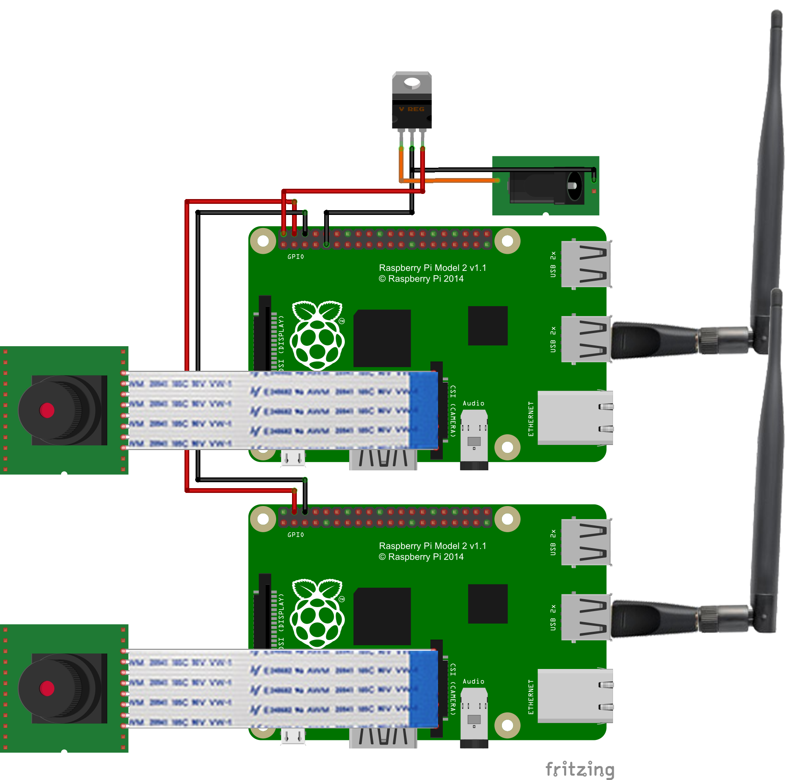
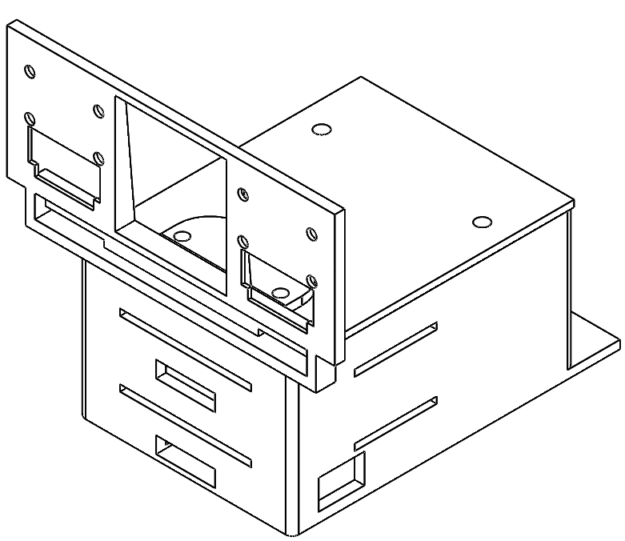

# Prototype Hardware
## Electronics
### Bill of Materials
* 2x Raspberry Pi A+ / B+ / 2B
* 2x Raspberry Pi Camera Module (preferably [ArduCam](http://www.arducam.com/raspberry-pi-camera-rev-c-improves-optical-performance/) improved version)
* 2x SD / MicroSD Card to suit Pi
* 2x USB WiFi Adaptor
* 1x 2P-2P Female Jumper Cable

The system can be powered by a microUSB cable - just make sure your power source can do ~ 2A. A USB socket on a computer won't do, but most 'fast' phone charges should do the trick. If you want to use a battery (or other non-USB power source) you'll also need:
* 1x 5V Voltage Regulator, minimum 2A (Pololu have an excellent [module](https://www.pololu.com/product/2851) to suit 5V/5A, 7-38V Input)
* 1x Suitable Power Connector (I used an XT60 to pair with LiPo batteries I had on hand)

### Fritzing Diagram

## Mechanical
A 3D-printable case has been designed to house two Raspberry Pi modules, and to mount two cameras at approximate eye spacing.

The files for this case can be found in the CAD folder, with SolidWorks source files and STL files for printing.

The following files are required regardless of configuration:
* double-pi-box
* box-lid

Depending on camera choice, there are two files available:
* camera-bracket-arducam
* camera-bracket-standard

In addition to these printed parts, the following fixings are required:
* 8x M3 Standoff, 18mm
* 8x M3 Nut
* 4x M3x10 Bolt

The standard Raspberry Pi Camera modules require M2 mounting hardware:
* 8x M2x10 Bolt
* 8x M2 Nut

The Arducam Camera modules use M3 mounting hardware:
* 8x M3x10 Bolt
* 8x M3 Nut
