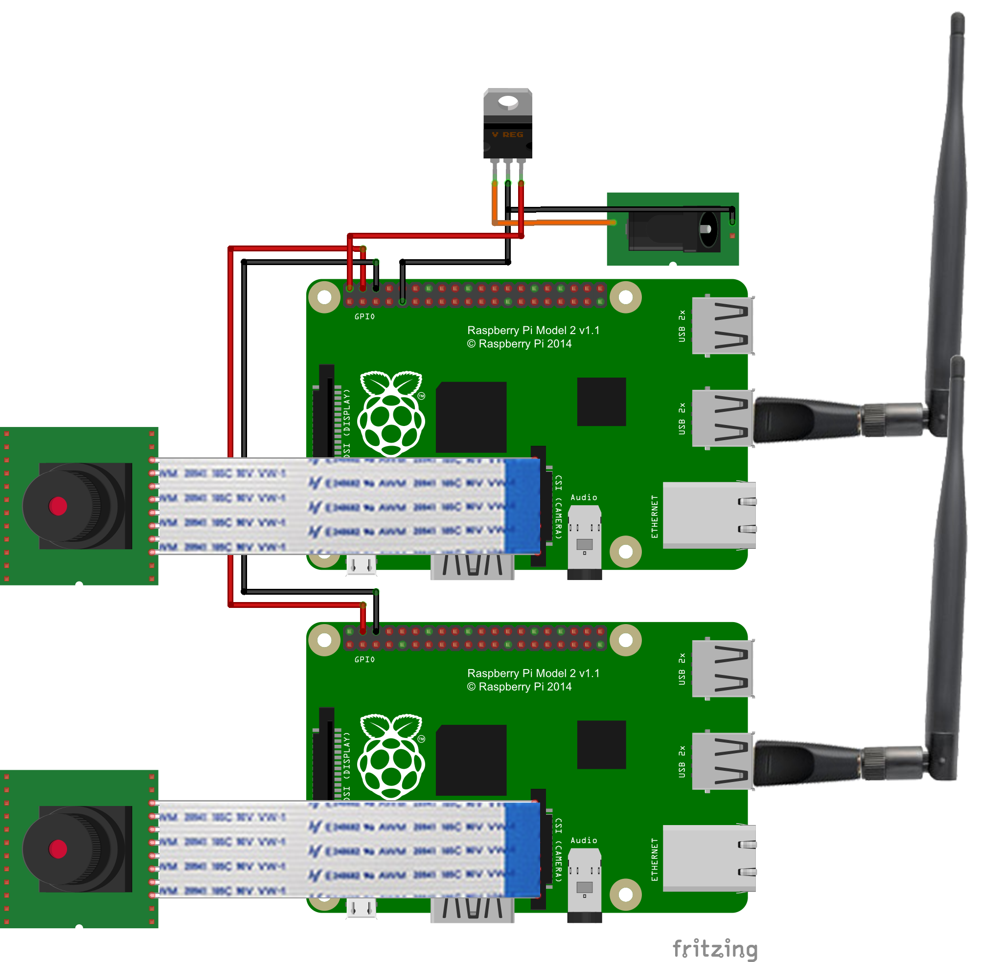

## Required Hardware
* 2x Raspberry Pi A+ / B+ / 2B
* 2x Raspberry Pi Camera Module (preferably [ArduCam](http://www.arducam.com/raspberry-pi-camera-rev-c-improves-optical-performance/) improved version)
* 2x SD / MicroSD Card to suit Pi
* 2x USB WiFi Adaptor
* 1x 2P-2P Female Jumper Cable

The system can be powered by a microUSB cable - just make sure your power source can do ~ 2A. A USB socket on a computer won't do, but most 'fast' phone charges should do the trick. If you want to use a battery (or other non-USB power source) you'll also need:
* 1x 5V Voltage Regulator, minimum 2A (Pololu have an excellent [module](https://www.pololu.com/product/2851) to suit 5V/5A, 7-38V Input)
* 1x Suitable Power Connector (I used an XT60 to pair with LiPo batteries I had on hand)

## Fritzing Diagram

